---

class: title
# Bioconda and BioContainers
## Enabling Universal Reproducibility in Galaxy

John Chilton, Marius van den Beek, Björn Grüning, and the Galaxy Team

The Slides @ http://bit.ly/gcc-biocontainers

The Twitters `#usegalaxy` `@jmchilton`

???

---

## Generic Containers are Good Slide

.center[.image-75[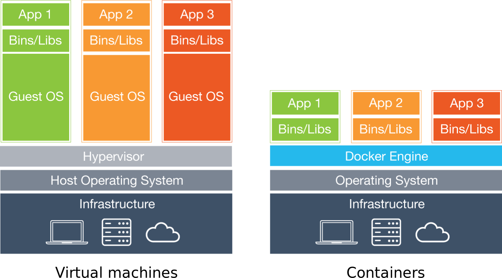]]

* Isolation and Security\*
* Reproducibility
* Flexibility\*

.center[.footnote[\* the industry is getting there]]

???

I'm not going to belabor the point made frequently - containers are light
weight alternatives to more traditional virtualization technology. The have
real possiblity of providing more secure, reproducible, and flexible ways
to execute tools in Galaxy.

---

## Galaxy in Containers?

.center[
.image-75[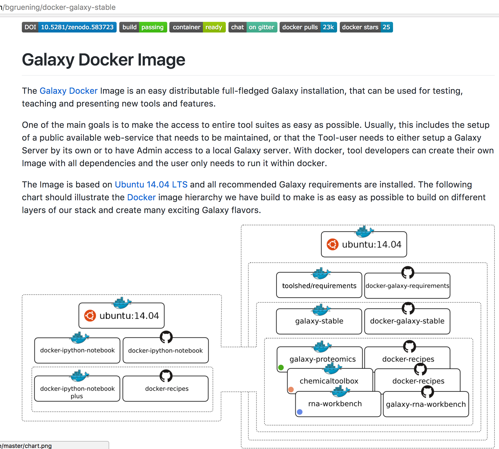]
]

???

When people think Galaxy and containers I think this project comes to mind.
Three years ago Björn created this docker-galaxy-stable project and it has
been wildly successful. It has proven to be a useful toolkit for advanced
deployment options, an extremely portable way to bring Galaxy to new domains,
and a brilliant tool for training users.

https://github.com/bgruening/docker-galaxy-stable/commit/27ef7966508958dfec9ce35ff1c5f076ffccf80f

Also mention Galaxy KickStart as a way to run Galaxy itself in a container.

---

## Containerizing Galaxy vs Tools

.enlarge120[
We are going to discuss *containerizing jobs* instead of all of Galaxy.

Small containers for a job's tool.

However you deploy Galaxy, including in a container, tool execution can still be containerized.
]

???

So we are talking about running Galaxy's jobs in containers, not Galaxy itself. We will be discussing
matching minimal best practice containers for particular tools.

Small, best-practice containers for a job's tool.

Even if you deploy Galaxy via a container, you can still containerize its jobs - so this approach is
complimentary to docker-galaxy-stable not competing.s 

---

class: left

## Containerizing Tools is Still Important

.enlarge120[
* Isolated tool execution environment.
* Isolated file system access.
* Added layer of security.
* *Increased re-computability*.
* New deployment options - Kubernetes, Mesos Chronos, AWS EC2 Container Service, etc.
]

---

class: left

## Containerizing Tool Execution

#### Decomposes into two basic problems:

.enlarge120[

* <i class="fa fa-square-o" aria-hidden="true"></i> Instruct Galaxy where to find a container for the tool.
* <i class="fa fa-square-o" aria-hidden="true"></i> Instruct Galaxy to run the tool in a container.

]

---

### Over Three Years Ago...

.border[.center[.image-75[]]]

???

Opened this PR within a few months of Björn.
	
---

## Configuring Galaxy to Use Containers

Just configure the destination. For instance, transform the cluster destination:

```xml
<destination id="short_fast" runner="slurm">
    <param id="nativeSpecification">--time=00:05:00 --nodes=1</param>
</destination>
```

as follows:


```xml
<destination id="short_fast" runner="slurm">
    <param id="nativeSpecification">--time=00:05:00 --nodes=1</param>
    <param id="docker_enabled">true</parma>
    <param id="docker_sudo">false</param>
</destination>
```

---

## Containerizing Tool Execution

#### Decomposes into two basic problems:

.enlarge120[

* <i class="fa fa-square-o" aria-hidden="true"></i> Instruct Galaxy where to find a container for the tool.
* <i class="fa fa-check-square-o" aria-hidden="true"></i> Instruct Galaxy to run the tool in a container.

]

---

class: left

## Explicit Container Dependencies

```xml
<requirements>
    <requirement type="package" version="1.2">seqtk</requirement>
</requirements>
```

into

```xml
<requirements>
    <container type="docker">dukegcb/seqtk</container>
    <requirement type="package" version="1.2">seqtk</requirement>
</requirements>
```

---

## Containerizing Tool Execution

#### Decomposes into two basic problems:

.enlarge120[

* <i class="fa fa-check-square-o" aria-hidden="true"></i> Instruct Galaxy where to find a container for the tool.
* <i class="fa fa-check-square-o" aria-hidden="true"></i> Instruct Galaxy to run the tool in a container.

We're done... right?

]

???

---

class: left

## The Problems with Making Docker Explicit

.enlarge120[

* Setting up a `Dockerfile` and publishing a Docker image more process for the tool author even though the *dependencies have already been completely defined*.
* An arbitrary Docker image is a blackbox and there is *no guarantee Galaxy will execute the same binaries* as the Conda requirements.

]

---

## To Put it Another Way

.enlarge120[

This:

```xml
<requirements>
    <requirement type="package" version="1.2">seqtk</requirement>
</requirements>
```

should have been sufficient!

]

???

We shouldn't have had to modify the tool to get the containers working, and
indeed specifying containers separately from requirements introduced a strong
possibility of environment drift between package and container execution.

---

## Another Problem...

.enlarge120[

```xml
<requirements>
    <requirement type="package" version="1.2">seqtk</requirement>
</requirements>
```

In 2014, this wasn't even sufficient for normal, containerless execution.

The resolution of these requirements required a `tool_dependencies.xml` file and required the tool to be published to a tool shed before it could be resolved.

]

???

How can I build a container for that requirements set if that requirements set
is useless until the tool has been published to the tool shed.

---


Package, dependency and environment management

???

We needed a new package manager to be able to build and publish containers for a set of requirements.

---

### .image-25[] <br /> Conda Key Features for Galaxy

.enlarge120[

- No compilation at install time - *binaries* with their dependencies, libraries...
- Support for all operating systems Galaxy targets
- Easy to manage *multiple versions* of the same recipe
- HPC-ready: no root privileges needed
- Easy-to-write YAML recipes
- **Community** - not *restricted* to Galaxy

]

???

- Recipes: independent of the progamming language in which software is written
- Support for multiple versions at the same time is needed for reproducibility

Compared with the Tool Shed dependency management (`tool_dependencies.xml`), BioConda is:

- More popular!
- Easier to develop.
- Easier to install and test.

---

# Conda Has Flurished Since the Last GCC

---

## Enabled by Default

.center[.border[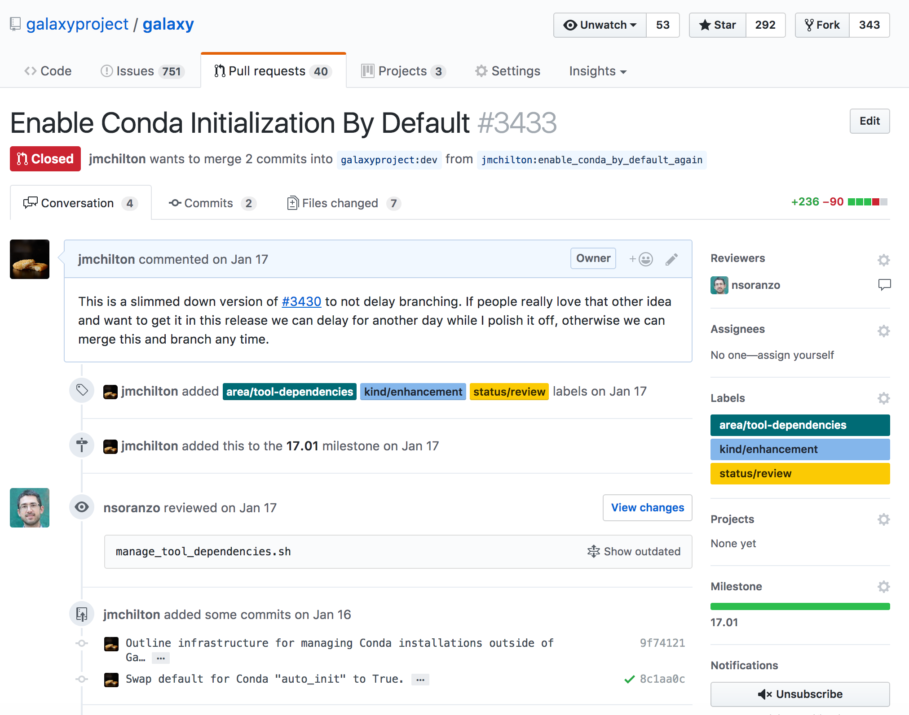]]

---

## Installing Tools with Conda

.center[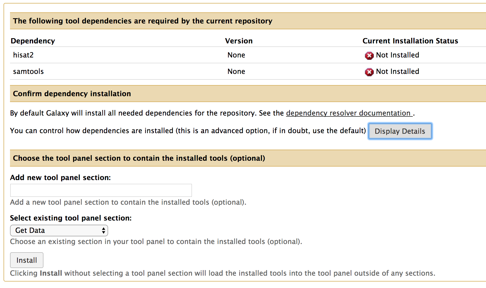]

Huge thanks to Marius van den Beek, Brad Langhorst, and Martin Cech.

???

This work started at last years GCC hackathon by Brad and Marius and was improved and refined
by Martin.

---

## Managing Tool Dependencies

.center[]

???

Marius followed up and added detailed admin controls for managing sets of dependencies. With
the older Tool Shed dependency management - sets of dependencies were dependent on the tool and
install context - so GUIs like this wouldn't have worked well.

---

## Planemo

.center[.image-90[.border[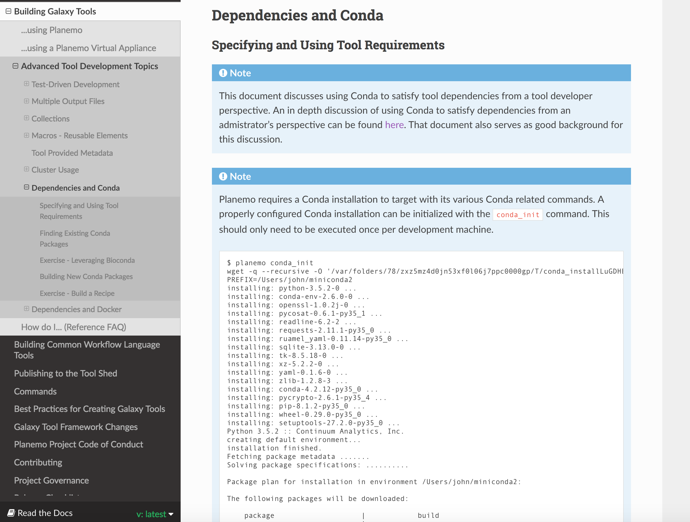]]]

Conda is enabled by default in Planemo and the documentation has been overhauled with detailed
Conda information.

---

## Training Material
 
---

# Conda has been a revolution for tool development and deployment.

---

## Back to Requirements...

.enlarge120[

```xml
<requirements>
    <requirement type="package" version="1.2">seqtk</requirement>
</requirements>
```

We can now install and resolve dependencies using this alone!

Therefore, we can *find and build containers using just this also*.

]

---

## BioConda

.border[.center[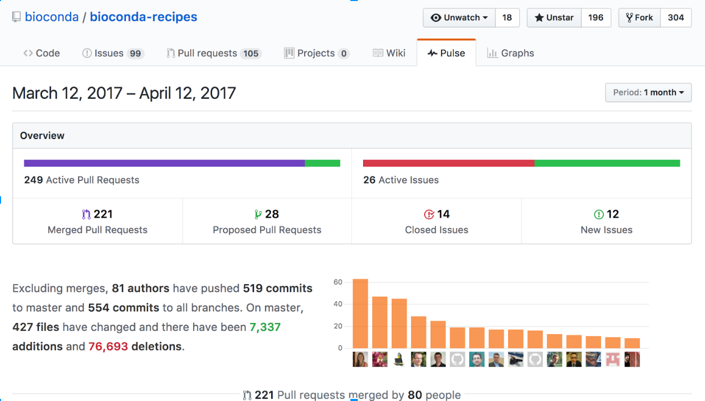]]

???

For comparison to similar projects - Homebrew-science has had 261 commits from 34 authors during the same period. DebianMed has had no new activity in 2017.

---

## BioContainers - Bioconda for Containers

.pull-right[.center[]]

**All** Bioconda packages are built into minimal containers.

This setup allows the **same binaries to be used within the container or on traditional/HPC resources**.
Without any extra work by tool authors, Galaxy can automatically find or build “the correct” container for a best-practice tool.

Over 2,300 containers already available.

*We are not aware of another platform that supports this level of reproducibility inside and outside of containers.*

---

## BioContainers - Already Published

.center[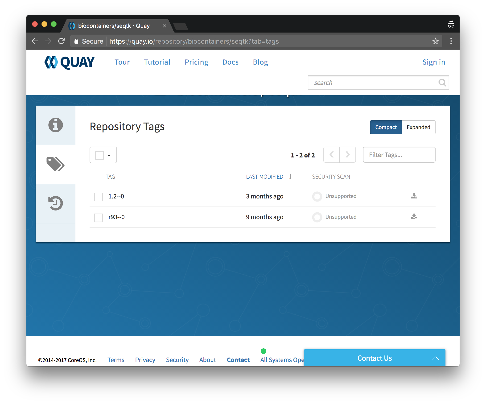]

---

class: left

## ~~The Problems with Making Docker Explicit~~

.enlarge120[

* ~~Setting up a `Dockerfile` and publishing a Docker image more process for the tool even though the *dependencies have already been completely defined*.~~
* ~~An arbitrary Docker image is a blackbox and there is *no guarantee Galaxy will execute the same binaries* as the Conda requirements.~~

Galaxy can now just find or build BioContainers from `requirement` tags in best practice tools.

]

---

## BioContainers - For Administrators

- In `galaxy.ini`, set `enable_beta_mulled_containers = True`
- In `job_conf.xml`, configure destination

```
<destination id="short_fast" runner="slurm">
    <param id="docker_enabled">true</parma>
    <param id="docker_sudo">false</param>
</destination>
```

???

Should work with all traditional cluster job runners, the local job runner, Pulsar, etc...

---

## BioContainers - For Developers (1 / 2)

<dl>
  <dt><b><code>planemo lint --conda_requirements my_tool.xml<code></b></dt>
  <dd><i>Check if all tool requirements are available in best practice Conda channels - this is required for BioContainers.</i></dd>
  <dt><b><code>planemo lint --biocontainers my_tool.xml<code></b></dt>
  <dd><i>Check if a BioContainers container has been published for this tool.</i></dd>
  <dt><b><code>planemo test --biocontainers my_tool.xml<code></b></dt>
  <dd><i>Run tool tests using a BioContainer (these will build on the fly if not published).</i></dd>
  <dt><b><code>planemo serve --biocontainers my_tool.xml<code></b></dt>
  <dd><i>Interactive testing using biocontainers.</i></dd>
  <dt><b><code>planemo mull my_tool.xml<code></b></dt>
  <dd><i>Build and locally cache a BioContainer for specified tool.</i></dd>
</dl>

---

## BioContainers - For Developers (2 / 2)

.border[.center[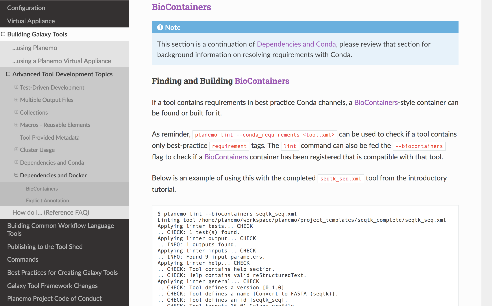]]

.footnote[.center[Also a Training Materials module!]]

---

## BioContainers - Multi-requirement Tools

```xml
<requirements>
    <requirement type="package" version="0.7.15">bwa</requirement>
    <requirement type="package" version="1.3.1">samtools</requirement>
</requirements>
```

.center[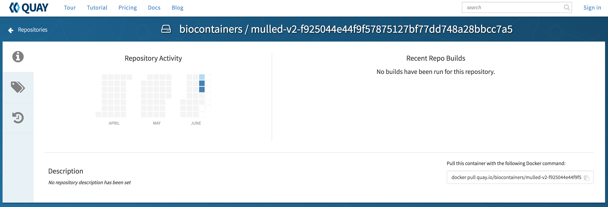]

---

## Exploring Mulled Hashes - by Evgeny Anatskiy

.center[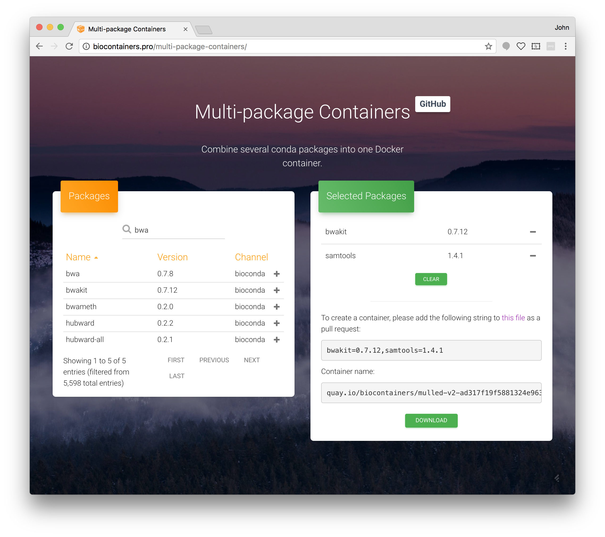]

.footer[.center[http://biocontainers.pro/multi-package-containers/]]

???

---

### Publishing **Your** Multi-Package Containers

.center[.border[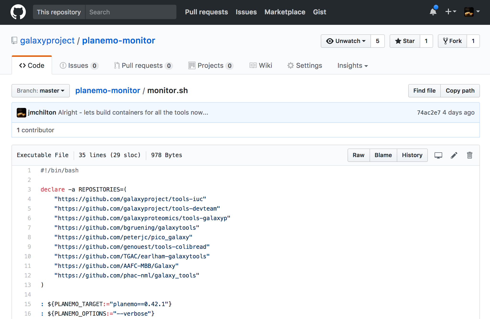]]

???

We are currently monitoring tools-iuc, tools-devteam, and a half a dozen other repositories
daily for package combinations to publish.

---

## Containerizing Tool Execution

#### Decomposes to basic problems

* <i class="fa fa-check-square-o" aria-hidden="true"></i><i class="fa fa-check-square-o" aria-hidden="true"></i> Instruct Galaxy where to find a container for the tool.
* <i class="fa fa-check-square-o" aria-hidden="true"></i> Instruct Galaxy to run the tool in a container.

---

.enlarge120[

Infrastructure for build and finding containers for *all* best practice tools allows us to start doing some awesome things!

I'll talk about a few - CWL, Singularity, and container scheduling - and mention a few more in the Future Work slide.

]

---

## HPC Centers and the Docker Problem

.enlarge120[

HPC centers are incredibly important to Galaxy's past and future.

HPC centers mostly dislike Docker.

]

---

.center[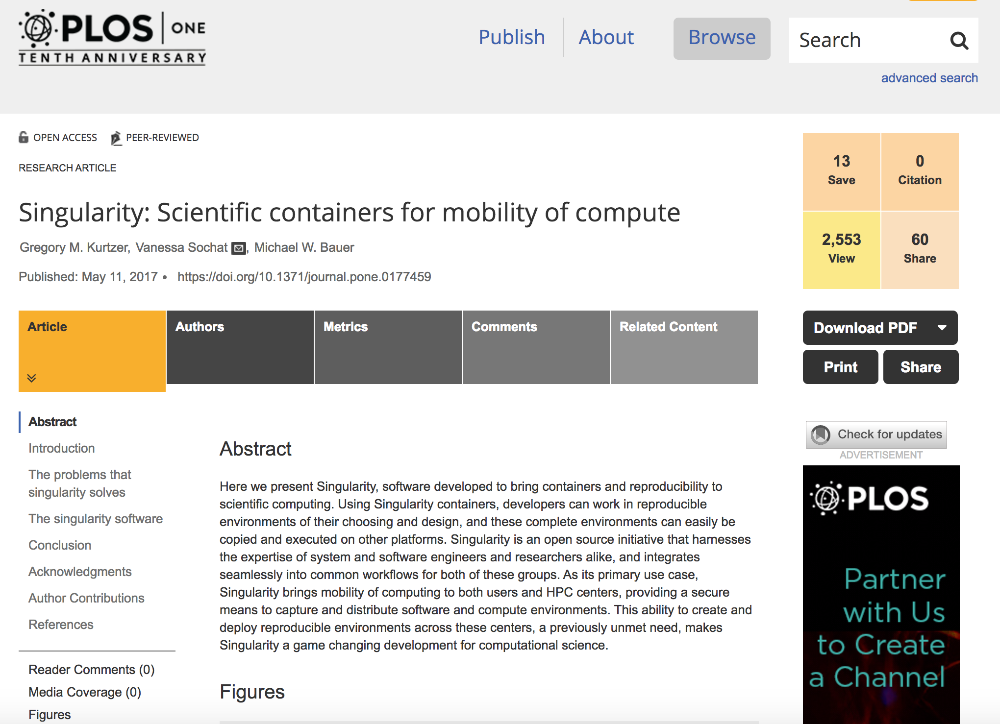]

---

From Singularity's about page:

> <i class="fa fa-quote-left" aria-hidden="true"></i> ***Singularity blocks privilege escalation*** within the container so if you want to be root inside the container, you first must be root outside the container. This usage paradigm mitigates many of the security concerns that exists with containers on multi-tenant shared resources.<i class="fa fa-quote-right" aria-hidden="true"></i>

http://singularity.lbl.gov/about

---

.border[.center[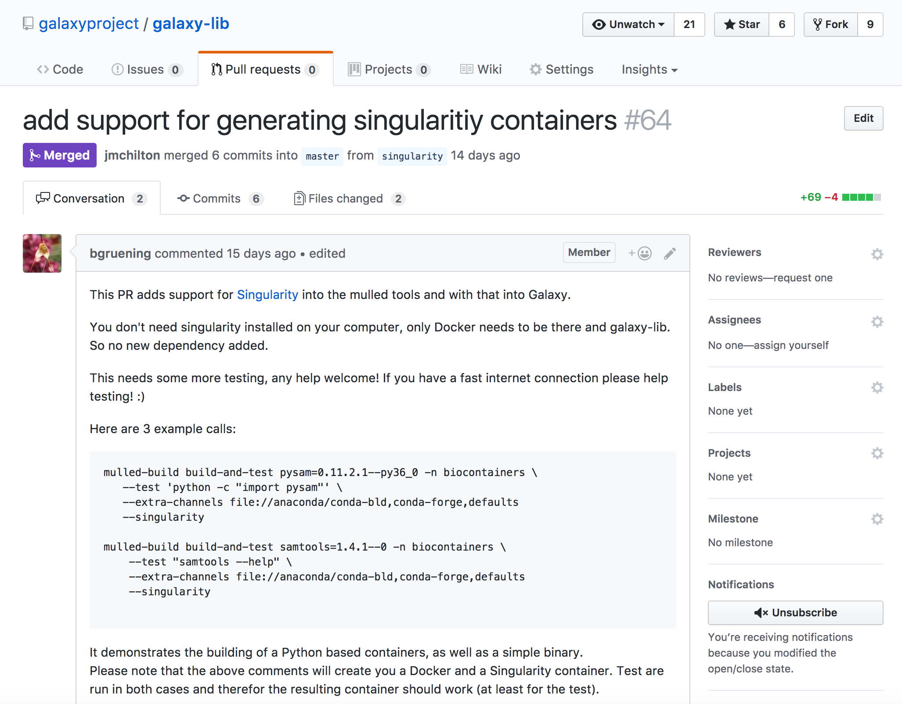]]

.center[Build Singularity images beside Docker images.]

---

.border[.center[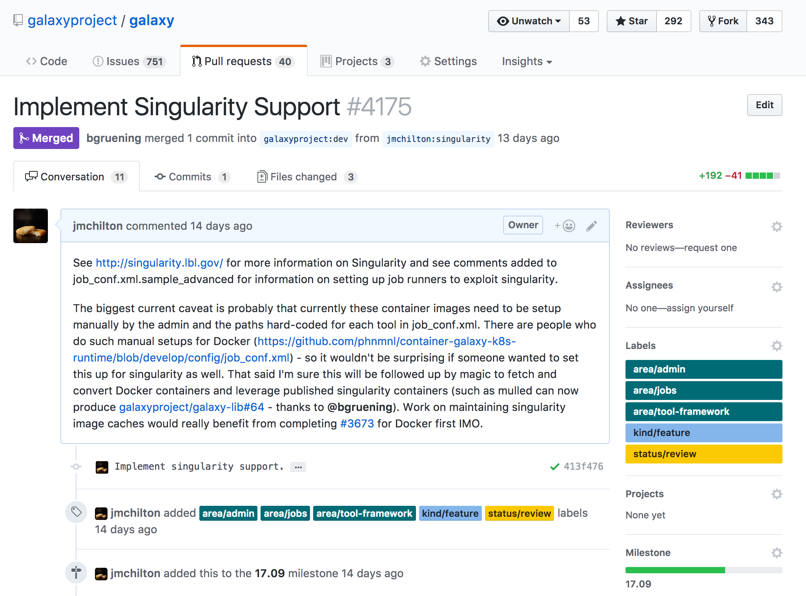]]

.center[Uses the same find or build strategy as Docker.]

---

.border[.center[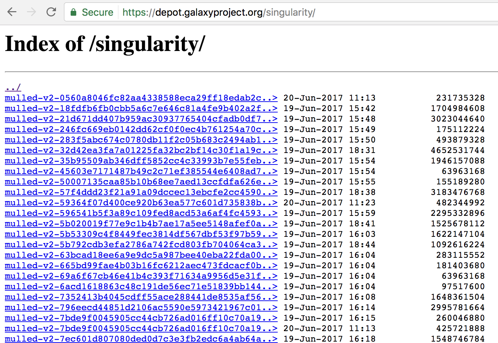]]

.center[We've started publishing Singularity images.]

---

## Using Singularity (requires Galaxy 17.09)

- In `galaxy.ini`, set `enable_beta_mulled_containers = True`
- In `job_conf.xml`, configure destination

```
<destination id="short_fast" runner="slurm">
    <param id="singularity_enabled">true</parma>
</destination>
```

---

## We didn't forget about HPC - we made packages more robust for HPC cluster as we also integrated HPC friendly containerization.

---

## Common Workflow Language Support

.border[.center[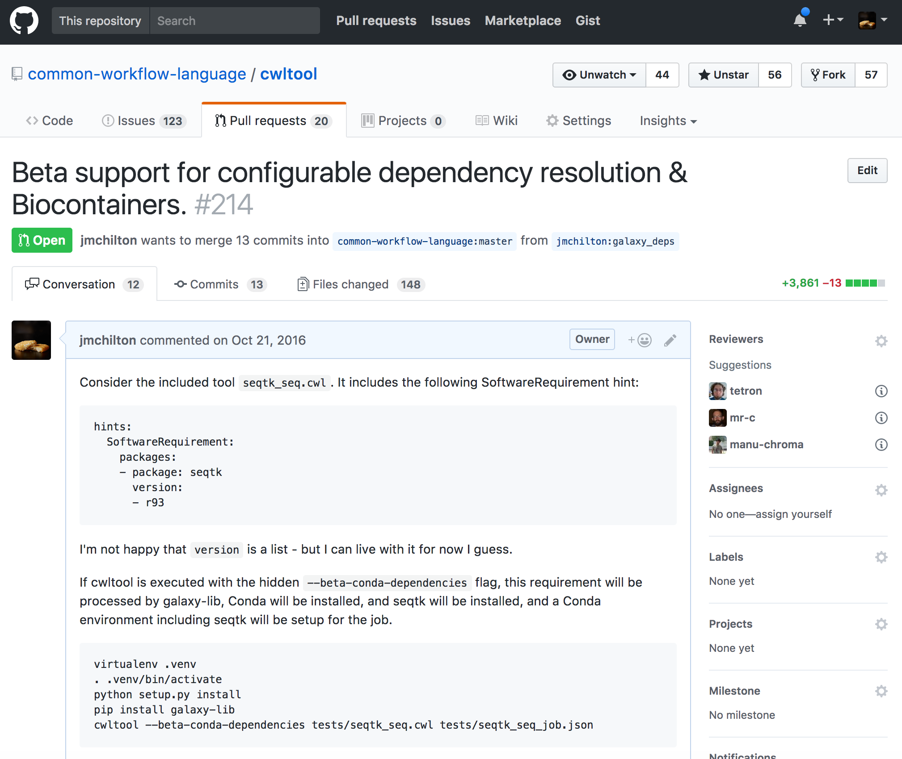]]

The same reproducibility stack using the same libraries can be integrated into CWL (Conda + BioContainers).

---

## Scheduling - From Clusters to Containers

**Cluster Jobs**

- Submit a script to execution infrastructure.
- Execution infrastructure is DRM (e.g. SLURM) schedules job script.
- Run directly on cluster node (bare metal or VM).

**Containerized Cluster Jobs (Before 2017)**

- Submit a script to execution infrastructure.
- Execution infrastructure is DRM (e.g. SLURM) schedules job script.
- *Script runs command via Docker host on cluster node.*

**Native Container Jobs (2017 and Beyond)**

- Submit container ID and command to infrastructure.
- Execution infrastructure (e.g. Kubernetes) schedules container execution directly.
- No need to manage clusters or Docker hosts.

---

## Docker Execution Goals

In moving from traditional cluster jobs to containerized cluster jobs the goal is *increased isolation and reproducibility*.

In moving from containerized cluster jobs to native container scheduling technologies is *elimination of cluster management software and delegating job scaling for service providers (e.g. Google and Amazon)*.

---

## Container Scheduling

From Amazon ECS

> <i class="fa fa-quote-left" aria-hidden="true"></i>Amazon ECS ***eliminates the need to install, operate, and scale your own cluster management infrastructure***, and allows you to schedule Docker-enabled applications across your cluster based on your resource needs and availability requirements. Amazon ECS enables you to ***grow from a single container to thousands of containers across hundreds of instances without any additional complexity*** in how you run your application.<i class="fa fa-quote-right" aria-hidden="true"></i>

https://aws.amazon.com/ecs/details/

---

### Container Scheduling - Three Current Galaxy Approaches

- Condor 
- Kubernetes
- Chronos for Mesos

---

class: center

### Container Scheduling - Condor

.center[.border[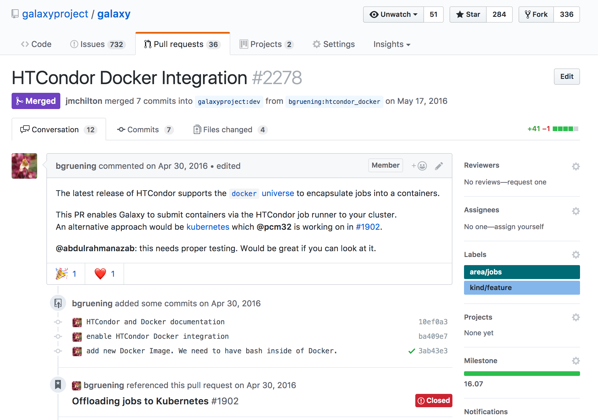]]

---

class: center

### Container Scheduling - Kubernetes

.center[.border[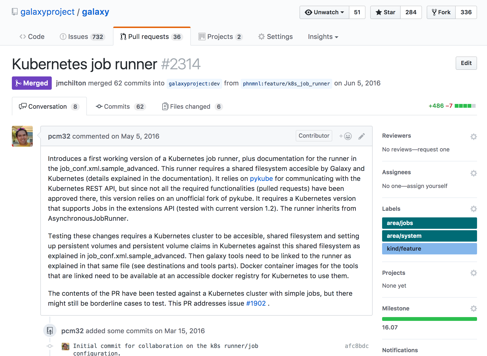]]

---

class: center

### Container Scheduling - Chronos for Mesos

.center[.border[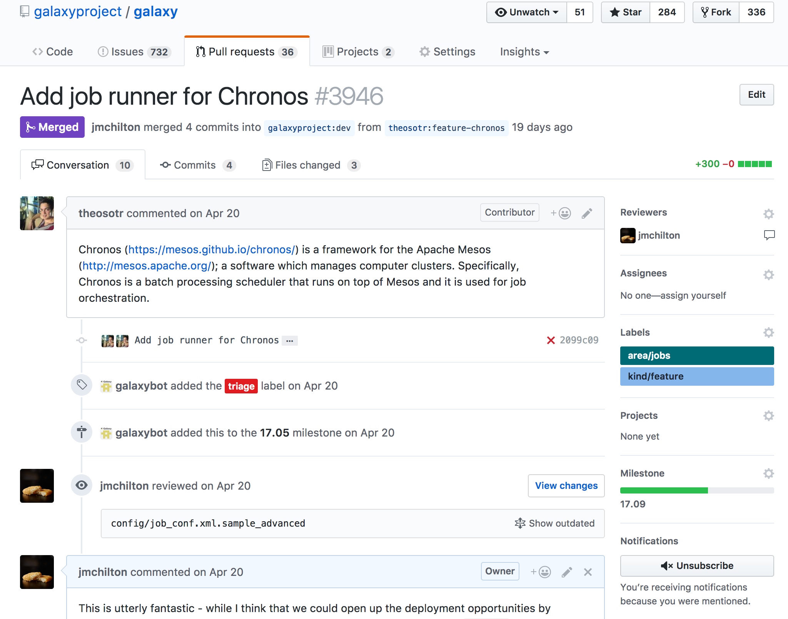]]

---

## Kubernetes

BoF tomorrow at lunch!

---

## Future Work

.enlarge120[

* Amazon EC2 Container Service
* GUI Management of Containers
* Infrastructure for Container Caching and Local Repository Mirrors

]
---

### Thanks

- Conda-ifying Galaxy and tools: Martin Cech, Brad Langhorst, and really the whole IUC and even beyond.
- Building container scheduling job runners: Pablo Moreno, Thodoris Sotiropoulos
- Multi-package hash explorer: Evgeny Anatskiy
- Common Workflow Language integration: James Taylor, Michael Crusoe, Peter Amstutz

---

###.image-25[] <br/> Conda distributions

```


```
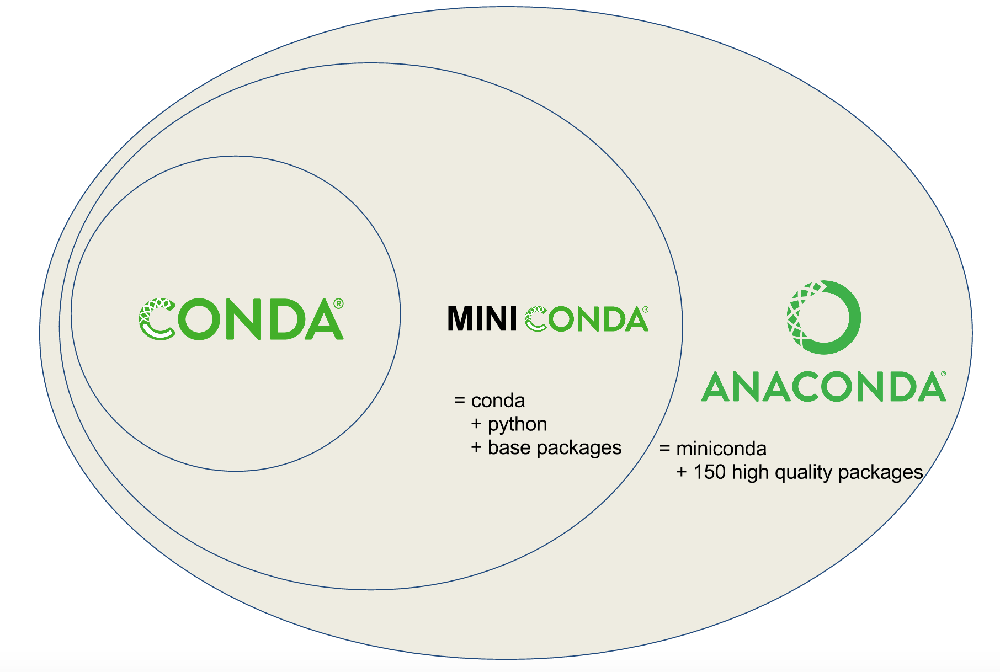

---

###.image-25[] <br/> Channels

- Packages through channels within Continuum.Anaconda
- Conda channel searched by Galaxy for packages:
    - iuc
    - bioconda
    - defaults
    - conda-forge

---

###.image-25[] <br/> Conda Terminology


Conda **recipes** build **packages** that are published to **channels**.

