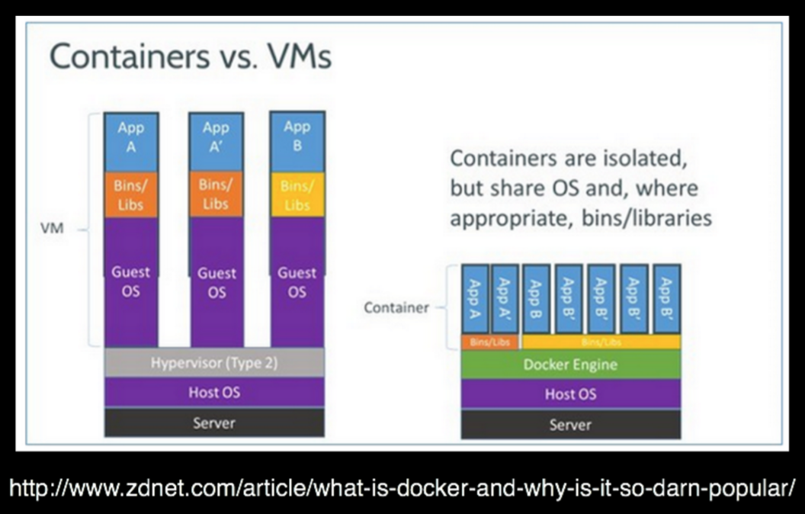
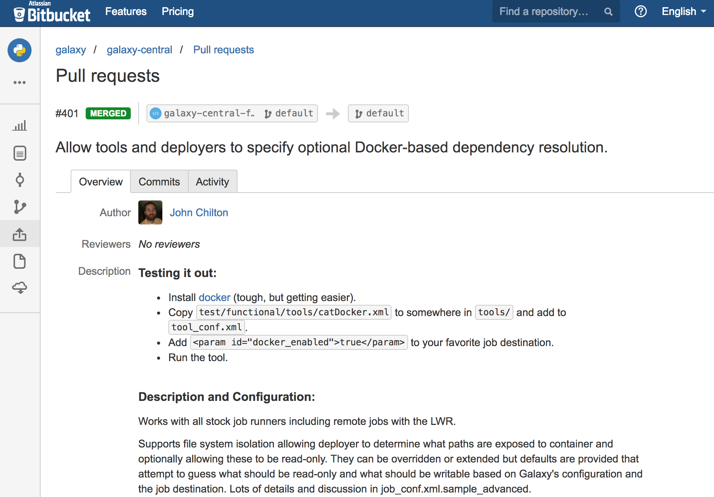

---

class: title
# Bioconda and BioContainers
## Enabling Universal Reproducibility in Galaxy

John Chilton, Marius van den Beek, Björn Grüning, and the Galaxy Team

The Slides @ http://bit.ly/bosc2016

The Twitters `#usegalaxy` `@jmchilton`

???

---

## Generic Containers are Good Slide

.image-75[]

* Isolation and Security\*
* Reproducibility
* Flexibility\*

.footnote[\* the industry is getting there]

???

---

## Galaxy in Containers?

.image-75[]

???

When people think Galaxy and containers I think this project comes to mind.
Three years ago Björn created this docker-galaxy-stable project and it has
been wildly successful. It has proven to be a useful toolkit for advanced
deployment options, an extremely portable way to bring Galaxy to new domains,
and a brilliant tool for training users.

https://github.com/bgruening/docker-galaxy-stable/commit/27ef7966508958dfec9ce35ff1c5f076ffccf80f

---

## Containerizing Galaxy vs Tools

???

TODO: Discuss difference - mention docker-galaxy-stable and galaxy-kickstarter

---

class: left

### Containerizing Tools is Important Also

* Isolated tool execution.
* Isolate file system access.
* Added layer of security.
* Increased re-computability.
* New deployment options - Kubernetes, Mesos Chronos, AWS Batch, etc.

---

class: left

### Containerizing Tool Execution

Decomposes to basic problems:

* <i class="fa fa-square-o" aria-hidden="true"></i> Instruct Galaxy where to find a container for the tool.
* <i class="fa fa-square-o" aria-hidden="true"></i> Instruct Galaxy to run the tool in a container.

---

### Three Years Ago...

.image-75[]

???

Opened this PR within a few months of Björn.
	
---

### Configuring Galaxy to Use Containers

Just configure the destination. For instance, transform the cluster destination:

```
<destination id="short_fast" runner="slurm">
    <param id="nativeSpecification">--time=00:05:00 --nodes=1</param>
</destination>
```

as follows:


```
<destination id="short_fast" runner="slurm">
    <param id="nativeSpecification">--time=00:05:00 --nodes=1</param>
    <param id="docker_enabled">true</parma>
    <param id="docker_sudo">false</param>
</destination>
```

---

class: left

## Explicit Container Dependencies

```
<requirements>
    <requirement type="package" version="1.2">seqtk</requirement>
</requirements>
```

into

```
<requirements>
    <container type="docker">dukegcb/seqtk</container>
    <requirement type="package" version="1.2">seqtk</requirement>
</requirements>
```

---

### Containerizing Tool Execution

#### Decomposes to basic problems

* <i class="fa fa-check-square-o" aria-hidden="true"></i> Instruct Galaxy where to find a container for the tool.
* <i class="fa fa-check-square-o" aria-hidden="true"></i> Instruct Galaxy to run the tool in a container.

We're done... right?

???

---

class: left

## The Problems with Making Docker Explicit

* Setting up a `Dockerfile` and publishing a Docker image more process for the tool even though the dependencies have already been completely defined.
* An arbitrary Docker image is a blackbox that we can't be sure will execute the same binaries as the Conda requirements.

---

## Put it Another Way

This:

```
<requirements>
    <requirement type="package" version="1.2">seqtk</requirement>
</requirements>
```

should have been sufficient!

---

## Put it Another Way

```
<requirements>
    <requirement type="package" version="1.2">seqtk</requirement>
</requirements>
```

In 2014, this wasn't even sufficient for containerless execution. The resolution of these requirements required a `tool_dependencies.xml` file and required the tool to be published to a tool shed before it could be resolved.

???

How can I build a container for that requirements set if that requirements set is useless until the tool has 
been published to the tool shed.

---


Package, dependency and environment management

---

.image-50[]

- Based on recipes describing how to install the software which are then built for their distribution
- No compilation at installation: binaries with their dependencies, libraries...
- Not restricted to Galaxy

---

###.image-25[] <br/> Conda distributions

```


```


---

###.image-25[] <br/> Channels

- Packages through channels within Continuum.Anaconda
- Conda channel searched by Galaxy for packages:
    - iuc
    - bioconda
    - defaults
    - r
    - conda-forge
